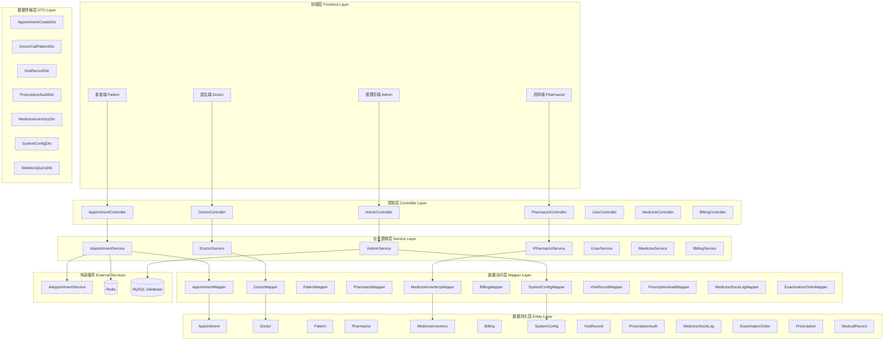
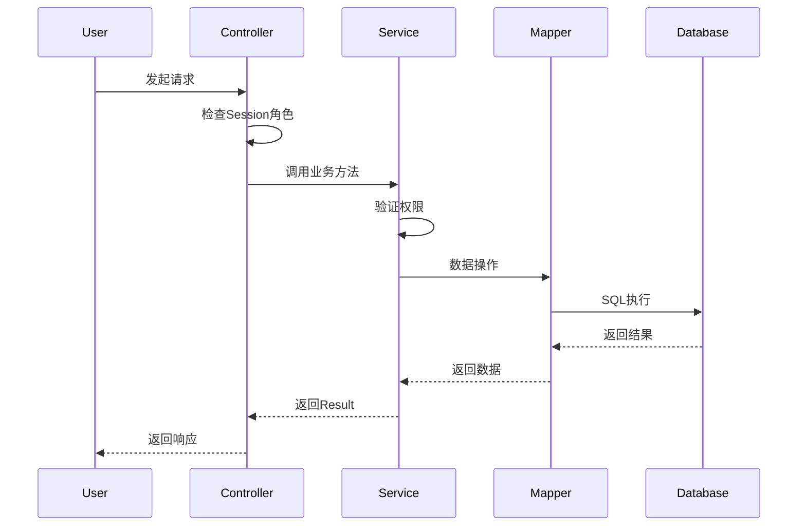
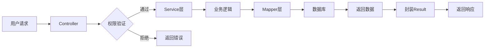

# 医院信息系统（HIS）分层架构图

## 整体架构

## 详细分层说明

### 1. 前端层（Frontend Layer）
- **患者端**：预约挂号、挂号登记、地点查询、病历查看
- **医生端**：接诊管理、患者呼叫、电子病历、处方开具
- **药师端**：处方审核、药品管理、库存监控
- **管理员端**：系统配置、用户管理、统计分析

### 2. 控制层（Controller Layer）
负责接收HTTP请求，参数验证，调用Service层

| Controller | 主要功能 |
|------------|---------|
| AppointmentController | 预约管理、挂号登记、地点查询 |
| DoctorController | 医生接诊、患者呼叫、就诊记录 |
| PharmacistController | 处方审核、药品库存管理 |
| AdminController | 系统配置、用户管理、统计分析 |
| UserController | 用户认证、权限管理 |
| MedicineController | 药品信息查询 |
| BillingController | 费用查询、支付管理 |

### 3. 业务逻辑层（Service Layer）
核心业务逻辑处理，事务管理，权限控制

| Service | 主要方法 |
|---------|---------|
| IAppointmentService | createAppointment, cancelAppointment, registration, getLocation |
| IDoctorService | getTodayAppointments, callPatient, startVisit, endVisit |
| IPharmacistService | auditPrescription, dispenseMedicine, manageInventory |
| IAdminService | getStatistics, updateSystemConfig, getUserManagement |
| IUserService | login, register, updateProfile |
| IMedicineService | queryMedicine, searchMedicine |
| IBillingService | createBilling, payBill, queryBill |

### 4. 数据访问层（Mapper Layer）
使用MyBatis-Plus进行数据库操作

| Mapper | 对应实体 |
|--------|---------|
| AppointmentMapper | Appointment |
| DoctorMapper | Doctor |
| PatientMapper | Patient |
| PharmacistMapper | Pharmacist |
| MedicineInventoryMapper | MedicineInventory |
| BillingMapper | Billing |
| SystemConfigMapper | SystemConfig |
| VisitRecordMapper | VisitRecord |
| PrescriptionAuditMapper | PrescriptionAudit |
| MedicineStockLogMapper | MedicineStockLog |
| ExaminationOrderMapper | ExaminationOrder |

### 5. 数据持久层（Entity Layer）
数据库实体映射

| Entity | 说明 |
|--------|------|
| Appointment | 预约记录 |
| Doctor | 医生信息 |
| Patient | 患者信息 |
| Pharmacist | 药师信息 |
| MedicineInventory | 药品库存 |
| Billing | 账单信息 |
| SystemConfig | 系统配置 |
| VisitRecord | 就诊记录 |
| PrescriptionAudit | 处方审核 |
| MedicineStockLog | 库存变动日志 |
| ExaminationOrder | 检查单 |
| Prescription | 处方 |
| MedicalRecord | 病历 |

### 6. 数据传输层（DTO Layer）
请求和响应数据传输对象

| DTO | 用途 |
|-----|------|
| AppointmentCreateDto | 创建预约请求 |
| DoctorCallPatientDto | 医生呼叫患者 |
| VisitRecordDto | 就诊记录 |
| PrescriptionAuditDto | 处方审核 |
| MedicineInventoryDto | 药品库存 |
| SystemConfigDto | 系统配置 |
| StatisticsQueryDto | 统计查询 |

### 7. 外部服务（External Services）
- **AiAppointmentService**：AI智能推荐
- **Redis**：分布式锁、缓存
- **MySQL**：数据持久化

## 权限控制流程

## 数据流向

## 技术栈

| 层级 | 技术组件 |
|------|---------|
| 前端 | HTML/JavaScript/Vue.js |
| 控制层 | Spring Boot 3.2.5 |
| 业务层 | Spring Service, Transaction |
| 数据访问 | MyBatis-Plus |
| 数据库 | MySQL 8.0 |
| 缓存 | Redis |
| 工具 | Lombok, Jakarta Validation |
| AI服务 | AiAppointmentService |

## 核心设计原则

1. **单一职责**：每层只负责自己的职责
2. **依赖倒置**：高层模块不依赖低层模块，都依赖抽象
3. **接口隔离**：使用接口定义服务契约
4. **开闭原则**：对扩展开放，对修改关闭
5. **权限隔离**：严格的RBAC权限控制
6. **事务管理**：关键操作使用@Transactional
7. **分布式锁**：使用Redis防止并发问题