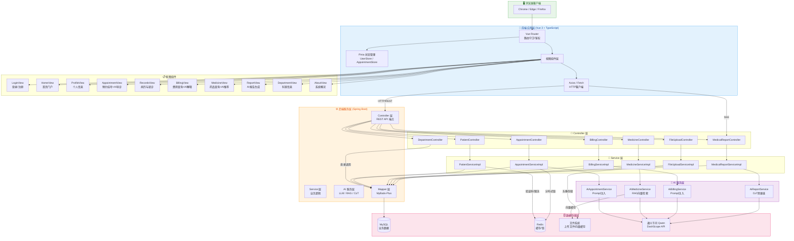
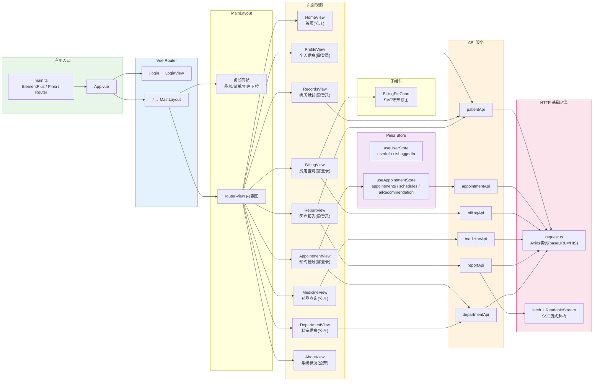
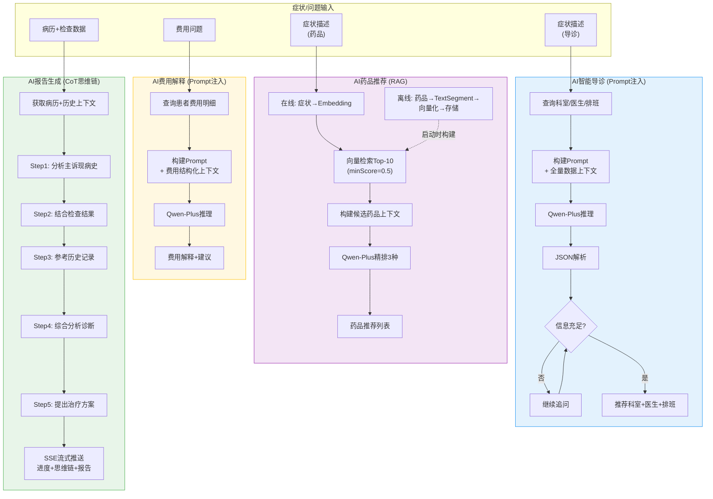
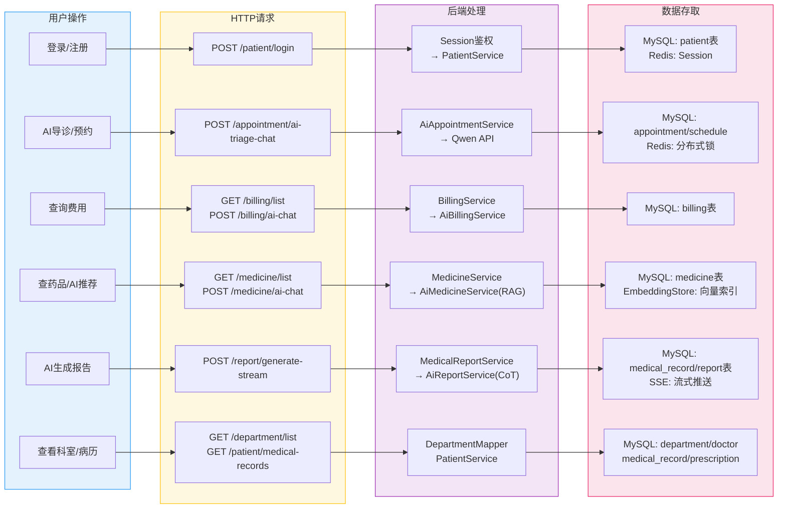
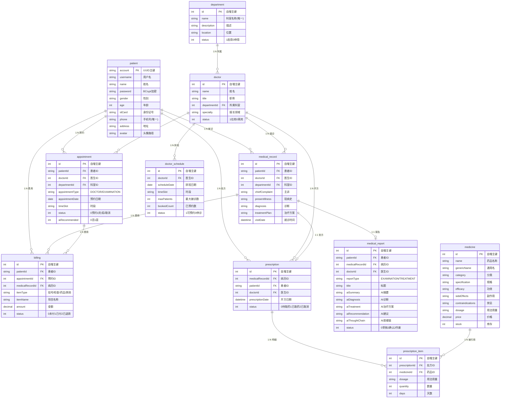
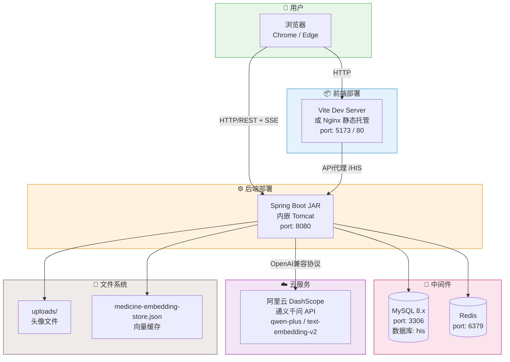
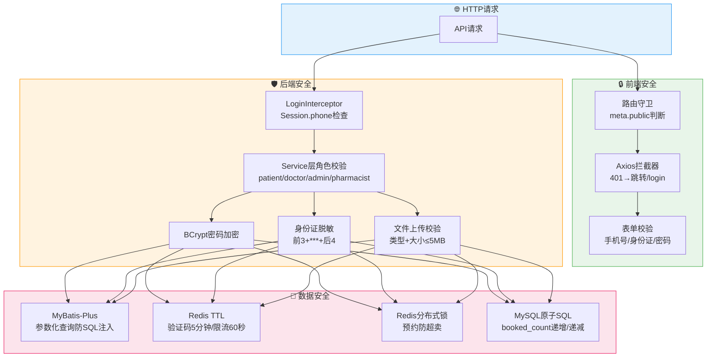

# 医院信息系统（HIS）架构图

---

## 一、系统总体架构图

```mermaid
graph TB
    subgraph 客户端["🖥️ 浏览器客户端"]
        Browser["Chrome / Edge / Firefox"]
    end

    subgraph 前端["📱 前端应用层 (Vue 3 + TypeScript)"]
        Router["Vue Router<br/>路由守卫/鉴权"]
        Store["Pinia 状态管理<br/>UserStore / AppointmentStore"]
        Views["视图组件层"]
        API["Axios / Fetch<br/>HTTP客户端"]
    end

    subgraph 视图层详情["📋 视图组件"]
        V1["LoginView<br/>登录/注册"]
        V2["HomeView<br/>首页门户"]
        V3["ProfileView<br/>个人信息"]
        V4["AppointmentView<br/>预约挂号+AI导诊"]
        V5["RecordsView<br/>病历与就诊"]
        V6["BillingView<br/>费用查询+AI解释"]
        V7["MedicineView<br/>药品查询+AI推荐"]
        V8["ReportView<br/>AI报告生成"]
        V9["DepartmentView<br/>科室信息"]
        V10["AboutView<br/>系统概况"]
    end

    subgraph 后端["⚙️ 后端服务层 (Spring Boot)"]
        Controller["Controller 层<br/>REST API 端点"]
        Service["Service 层<br/>业务逻辑"]
        AIService["AI 服务层<br/>LLM / RAG / CoT"]
        Mapper["Mapper 层<br/>MyBatis-Plus"]
    end

    subgraph 控制层["🎯 Controller 层"]
        C1["PatientController"]
        C2["AppointmentController"]
        C3["BillingController"]
        C4["MedicineController"]
        C5["MedicalReportController"]
        C6["DepartmentController"]
        C7["FileUploadController"]
    end

    subgraph 业务层["💼 Service 层"]
        S1["PatientServiceImpl"]
        S2["AppointmentServiceImpl"]
        S3["BillingServiceImpl"]
        S4["MedicineServiceImpl"]
        S5["MedicalReportServiceImpl"]
        S6["FileUploadServiceImpl"]
    end

    subgraph AI层["🤖 AI 服务层"]
        AI1["AiAppointmentService<br/>Prompt注入"]
        AI2["AiMedicineService<br/>RAG向量检索"]
        AI3["AiBillingService<br/>Prompt注入"]
        AI4["AiReportService<br/>CoT思维链"]
    end

    subgraph 基础设施["🗄️ 数据存储层"]
        MySQL[("MySQL<br/>业务数据")]
        Redis[("Redis<br/>缓存/锁")]
        FileSystem["文件系统<br/>上传文件/向量缓存"]
        Qwen["通义千问 Qwen<br/>DashScope API"]
    end

    Browser --> Router
    Router --> Store
    Router --> Views
    Views --> API
    API -->|HTTP/REST| Controller
    API -->|SSE| C5

    Views --> V1 & V2 & V3 & V4 & V5 & V6 & V7 & V8 & V9 & V10

    Controller --> C1 & C2 & C3 & C4 & C5 & C6 & C7
    C1 --> S1
    C2 --> S2
    C3 --> S3
    C4 --> S4
    C5 --> S5
    C6 -->|直接调用| Mapper
    C7 --> S6

    S2 --> AI1
    S4 --> AI2
    S3 --> AI3
    S5 --> AI4

    S1 & S2 & S3 & S4 & S5 & S6 --> Mapper
    Mapper --> MySQL
    S1 -->|验证码/限流| Redis
    S2 -->|分布式锁| Redis
    AI1 & AI2 & AI3 & AI4 --> Qwen
    AI2 -->|向量缓存| FileSystem
    S6 -->|头像存储| FileSystem

    style 客户端 fill:#e8f5e9,stroke:#4caf50,color:#1b5e20
    style 前端 fill:#e3f2fd,stroke:#2196f3,color:#0d47a1
    style 后端 fill:#fff3e0,stroke:#ff9800,color:#e65100
    style 基础设施 fill:#fce4ec,stroke:#e91e63,color:#880e4f
    style AI层 fill:#f3e5f5,stroke:#9c27b0,color:#4a148c
```

---

## 二、前端架构图

```mermaid
graph LR
    subgraph 入口["应用入口"]
        Main["main.ts<br/>ElementPlus / Pinia / Router"]
        App["App.vue"]
    end

    subgraph 路由["Vue Router"]
        R1["/login → LoginView"]
        R2["/ → MainLayout"]
    end

    subgraph 布局["MainLayout"]
        Header["顶部导航<br/>品牌/菜单/用户下拉"]
        Content["router-view 内容区"]
    end

    subgraph 页面["页面视图"]
        P1["HomeView<br/>首页(公开)"]
        P2["ProfileView<br/>个人信息(需登录)"]
        P3["RecordsView<br/>病历就诊(需登录)"]
        P4["AppointmentView<br/>预约挂号(需登录)"]
        P5["MedicineView<br/>药品查询(公开)"]
        P6["BillingView<br/>费用查询(需登录)"]
        P7["ReportView<br/>医疗报告(需登录)"]
        P8["DepartmentView<br/>科室信息(公开)"]
        P9["AboutView<br/>系统概况(公开)"]
    end

    subgraph 子组件["子组件"]
        Chart["BillingPieChart<br/>SVG环形饼图"]
    end

    subgraph 状态["Pinia Store"]
        US["useUserStore<br/>userInfo / isLoggedIn"]
        AS["useAppointmentStore<br/>appointments / schedules / aiRecommendation"]
    end

    subgraph API层["API 服务"]
        PA["patientApi"]
        AA["appointmentApi"]
        BA["billingApi"]
        MA["medicineApi"]
        RA["reportApi"]
        DA["departmentApi"]
    end

    subgraph 请求["HTTP 基础封装"]
        Axios["request.ts<br/>Axios实例(baseURL=/HIS)"]
        SSE["fetch + ReadableStream<br/>SSE流式解析"]
    end

    Main --> App
    App --> R1 & R2
    R2 --> Header & Content
    Content --> P1 & P2 & P3 & P4 & P5 & P6 & P7 & P8 & P9
    P6 --> Chart
    P2 & P3 --> PA
    P4 --> AS --> AA
    P4 --> DA
    P5 --> MA
    P6 --> BA
    P7 --> RA & PA
    P8 --> DA
    PA & AA & BA & MA & RA & DA --> Axios
    RA --> SSE

    style 入口 fill:#e8f5e9,stroke:#4caf50
    style 路由 fill:#e3f2fd,stroke:#2196f3
    style 页面 fill:#fff8e1,stroke:#ffc107
    style 状态 fill:#f3e5f5,stroke:#9c27b0
    style API层 fill:#fff3e0,stroke:#ff9800
    style 请求 fill:#fce4ec,stroke:#e91e63
```

---

## 三、后端架构图

```mermaid
graph TB
    subgraph 入口["Spring Boot 应用"]
        App["HIS Application<br/>port:8080 context:/HIS"]
    end

    subgraph 拦截["拦截器 & 配置"]
        LoginInt["LoginInterceptor<br/>Session鉴权"]
        WebCfg["WebConfig<br/>拦截路径/静态资源"]
        GlobalEx["GlobalExceptionHandler<br/>统一异常处理"]
        RedisCfg["RedisConfig<br/>JSON序列化"]
        MPCfg["MybatisPlusConfig<br/>分页插件"]
    end

    subgraph 控制器["Controller 层"]
        PC["PatientController<br/>/patient"]
        AC["AppointmentController<br/>/appointment"]
        BC["BillingController<br/>/billing"]
        MC["MedicineController<br/>/medicine"]
        RC["MedicalReportController<br/>/report"]
        DC["DepartmentController<br/>/department"]
        FC["FileUploadController<br/>/file"]
    end

    subgraph 服务["Service 层"]
        PS["PatientServiceImpl"]
        AS["AppointmentServiceImpl"]
        BS["BillingServiceImpl"]
        MS["MedicineServiceImpl"]
        RS["MedicalReportServiceImpl"]
        FS["FileUploadServiceImpl"]
        VS["VerificationCodeService<br/>(Redis验证码)"]
        DL["RedisDistributedLock<br/>(防超卖)"]
    end

    subgraph AI["AI 服务层 (LangChain4j)"]
        AI1["AiAppointmentService<br/>Prompt注入 + JSON解析"]
        AI2["AiMedicineService<br/>RAG向量检索 + LLM精排"]
        AI3["AiBillingService<br/>Prompt注入 + 费用解读"]
        AI4["AiReportService<br/>CoT思维链5步推理"]
    end

    subgraph AI配置["AiConfig"]
        ChatModel["ChatLanguageModel<br/>qwen-plus"]
        EmbedModel["EmbeddingModel<br/>text-embedding-v2"]
        EmbedStore["EmbeddingStore<br/>InMemory + 磁盘缓存"]
    end

    subgraph 数据层["Mapper 层 (MyBatis-Plus)"]
        PM["PatientMapper"]
        DM["DepartmentMapper"]
        DoM["DoctorMapper"]
        DSM["DoctorScheduleMapper<br/>(原子递增/递减)"]
        AM["AppointmentMapper"]
        MRM["MedicalRecordMapper"]
        MRP["MedicalReportMapper"]
        MM["MedicineMapper"]
        BM["BillingMapper"]
        PrM["PrescriptionMapper"]
        PIM["PrescriptionItemMapper"]
    end

    subgraph 存储["数据存储"]
        DB[("MySQL<br/>13张业务表")]
        RD[("Redis<br/>验证码/分布式锁")]
        FS2["文件系统<br/>uploads/向量缓存"]
        QW["通义千问 API<br/>DashScope"]
    end

    App --> LoginInt & WebCfg & GlobalEx & RedisCfg & MPCfg
    LoginInt --> PC & AC & BC & MC & RC & DC & FC
    PC --> PS
    AC --> AS
    BC --> BS
    MC --> MS
    RC --> RS
    DC --> DM & DoM
    FC --> FS

    PS --> PM & MRM & DM & DoM & PrM & PIM & MM
    PS --> VS
    AS --> AM & DSM & DoM & DM & PM
    AS --> AI1 & DL
    BS --> BM & PM
    BS --> AI3
    MS --> MM
    MS --> AI2
    RS --> MRP & MRM & DoM & PM
    RS --> AI4

    AI1 & AI3 & AI4 --> ChatModel
    AI2 --> ChatModel & EmbedModel & EmbedStore
    ChatModel --> QW
    EmbedModel --> QW

    PM & DM & DoM & DSM & AM & MRM & MRP & MM & BM & PrM & PIM --> DB
    VS --> RD
    DL --> RD
    PS --> FS2
    EmbedStore --> FS2

    style 入口 fill:#e8f5e9,stroke:#4caf50
    style 控制器 fill:#e3f2fd,stroke:#2196f3
    style 服务 fill:#fff8e1,stroke:#ffc107
    style AI fill:#f3e5f5,stroke:#9c27b0
    style 数据层 fill:#fff3e0,stroke:#ff9800
    style 存储 fill:#fce4ec,stroke:#e91e63
```

---

## 四、AI服务架构图

```mermaid
graph TB
    subgraph 用户输入["症状/问题输入"]
        Symptom1["症状描述<br/>(导诊)"]
        Symptom2["症状描述<br/>(药品)"]
        Question["费用问题"]
        Record["病历+检查数据"]
    end

    subgraph 导诊["AI智能导诊 (Prompt注入)"]
        D1["查询科室/医生/排班"]
        D2["构建Prompt<br/>+ 全量数据上下文"]
        D3["Qwen-Plus推理"]
        D4["JSON解析"]
        D5{"信息充足?"}
        D6["继续追问"]
        D7["推荐科室+医生+排班"]
    end

    subgraph 药品["AI药品推荐 (RAG)"]
        M1["离线: 药品→TextSegment→向量化→存储"]
        M2["在线: 症状→Embedding"]
        M3["向量检索Top-10<br/>(minScore=0.5)"]
        M4["构建候选药品上下文"]
        M5["Qwen-Plus精排3种"]
        M6["药品推荐列表"]
    end

    subgraph 费用["AI费用解释 (Prompt注入)"]
        B1["查询患者费用明细"]
        B2["构建Prompt<br/>+ 费用结构化上下文"]
        B3["Qwen-Plus推理"]
        B4["费用解释+建议"]
    end

    subgraph 报告["AI报告生成 (CoT思维链)"]
        R1["获取病历+历史上下文"]
        R2["Step1: 分析主诉现病史"]
        R3["Step2: 结合检查结果"]
        R4["Step3: 参考历史记录"]
        R5["Step4: 综合分析诊断"]
        R6["Step5: 提出治疗方案"]
        R7["SSE流式推送<br/>进度+思维链+报告"]
    end

    Symptom1 --> D1 --> D2 --> D3 --> D4 --> D5
    D5 -->|否| D6 --> D5
    D5 -->|是| D7

    Symptom2 --> M2 --> M3 --> M4 --> M5 --> M6
    M1 -.->|启动时构建| M3

    Question --> B1 --> B2 --> B3 --> B4

    Record --> R1 --> R2 --> R3 --> R4 --> R5 --> R6 --> R7

    style 导诊 fill:#e3f2fd,stroke:#2196f3
    style 药品 fill:#f3e5f5,stroke:#9c27b0
    style 费用 fill:#fff8e1,stroke:#ffc107
    style 报告 fill:#e8f5e9,stroke:#4caf50
```

---

## 五、数据流架构图

```mermaid
graph LR
    subgraph 前端操作["用户操作"]
        OP1["登录/注册"]
        OP2["AI导诊/预约"]
        OP3["查询费用"]
        OP4["查药品/AI推荐"]
        OP5["AI生成报告"]
        OP6["查看科室/病历"]
    end

    subgraph 请求["HTTP请求"]
        REQ1["POST /patient/login"]
        REQ2["POST /appointment/ai-triage-chat"]
        REQ3["GET /billing/list<br/>POST /billing/ai-chat"]
        REQ4["GET /medicine/list<br/>POST /medicine/ai-chat"]
        REQ5["POST /report/generate-stream"]
        REQ6["GET /department/list<br/>GET /patient/medical-records"]
    end

    subgraph 处理["后端处理"]
        PROC1["Session鉴权<br/>→ PatientService"]
        PROC2["AiAppointmentService<br/>→ Qwen API"]
        PROC3["BillingService<br/>→ AiBillingService"]
        PROC4["MedicineService<br/>→ AiMedicineService(RAG)"]
        PROC5["MedicalReportService<br/>→ AiReportService(CoT)"]
        PROC6["DepartmentMapper<br/>PatientService"]
    end

    subgraph 数据["数据存取"]
        D1["MySQL: patient表<br/>Redis: Session"]
        D2["MySQL: appointment/schedule<br/>Redis: 分布式锁"]
        D3["MySQL: billing表"]
        D4["MySQL: medicine表<br/>EmbeddingStore: 向量索引"]
        D5["MySQL: medical_record/report表<br/>SSE: 流式推送"]
        D6["MySQL: department/doctor<br/>medical_record/prescription"]
    end

    OP1 --> REQ1 --> PROC1 --> D1
    OP2 --> REQ2 --> PROC2 --> D2
    OP3 --> REQ3 --> PROC3 --> D3
    OP4 --> REQ4 --> PROC4 --> D4
    OP5 --> REQ5 --> PROC5 --> D5
    OP6 --> REQ6 --> PROC6 --> D6

    style 前端操作 fill:#e3f2fd,stroke:#2196f3
    style 请求 fill:#fff8e1,stroke:#ffc107
    style 处理 fill:#f3e5f5,stroke:#9c27b0
    style 数据 fill:#fce4ec,stroke:#e91e63
```

---

## 六、数据库ER关系图

```mermaid
erDiagram
    patient ||--o{ medical_record : "1:N 就诊"
    patient ||--o{ appointment : "1:N 预约"
    patient ||--o{ billing : "1:N 费用"
    patient ||--o{ prescription : "1:N 处方"

    department ||--o{ doctor : "1:N 所属"

    doctor ||--o{ medical_record : "1:N 接诊"
    doctor ||--o{ appointment : "1:N 被预约"
    doctor ||--o{ prescription : "1:N 开方"
    doctor ||--o{ doctor_schedule : "1:N 排班"

    medical_record ||--o| medical_report : "1:1 报告"
    medical_record ||--o| prescription : "1:1 处方"
    medical_record ||--o{ billing : "1:N 费用"

    appointment ||--o{ billing : "1:N 费用"

    prescription ||--o{ prescription_item : "1:N 明细"
    medicine ||--o{ prescription_item : "1:N 被引用"

    patient {
        string account PK "UUID主键"
        string username "用户名"
        string name "姓名"
        string password "BCrypt加密"
        string gender "性别"
        int age "年龄"
        string idCard "身份证号"
        string phone "手机号(唯一)"
        string address "地址"
        string avatar "头像路径"
    }

    department {
        int id PK "自增主键"
        string name "科室名称(唯一)"
        string description "描述"
        string location "位置"
        int status "1启用0停用"
    }

    doctor {
        int id PK "自增主键"
        string name "姓名"
        string title "职称"
        int departmentId FK "所属科室"
        string specialty "擅长领域"
        int status "1在岗0离岗"
    }

    doctor_schedule {
        int id PK "自增主键"
        int doctorId FK "医生ID"
        date scheduleDate "排班日期"
        string timeSlot "时段"
        int maxPatients "最大接诊数"
        int bookedCount "已预约数"
        int status "1可预约0停诊"
    }

    appointment {
        int id PK "自增主键"
        string patientId FK "患者ID"
        int doctorId FK "医生ID"
        int departmentId FK "科室ID"
        string appointmentType "DOCTOR/EXAMINATION"
        date appointmentDate "预约日期"
        string timeSlot "时段"
        int status "0预约1完成2取消"
        int aiRecommended "0否1是"
    }

    medical_record {
        int id PK "自增主键"
        string patientId FK "患者ID"
        int doctorId FK "医生ID"
        int departmentId FK "科室ID"
        string chiefComplaint "主诉"
        string presentIllness "现病史"
        string diagnosis "诊断"
        string treatmentPlan "治疗方案"
        datetime visitDate "就诊时间"
    }

    medical_report {
        int id PK "自增主键"
        string patientId FK "患者ID"
        int medicalRecordId FK "病历ID"
        int doctorId FK "医生ID"
        string reportType "EXAMINATION/TREATMENT"
        string title "标题"
        string aiSummary "AI摘要"
        string aiDiagnosis "AI诊断"
        string aiTreatment "AI治疗方案"
        string aiRecommendation "AI建议"
        string aiThoughtChain "AI思维链"
        int status "0草稿1确认2作废"
    }

    medicine {
        int id PK "自增主键"
        string name "药品名称"
        string genericName "通用名"
        string category "分类"
        string specification "规格"
        string efficacy "功效"
        string sideEffects "副作用"
        string contraindications "禁忌"
        string dosage "用法用量"
        decimal price "价格"
        int stock "库存"
    }

    billing {
        int id PK "自增主键"
        string patientId FK "患者ID"
        int appointmentId FK "预约ID"
        int medicalRecordId FK "病历ID"
        string itemType "挂号/检查/药品/其他"
        string itemName "项目名称"
        decimal amount "金额"
        int status "0未付1已付2已退款"
    }

    prescription {
        int id PK "自增主键"
        int medicalRecordId FK "病历ID"
        string patientId FK "患者ID"
        int doctorId FK "医生ID"
        datetime prescriptionDate "开方日期"
        int status "0待取药1已取药2已取消"
    }

    prescription_item {
        int id PK "自增主键"
        int prescriptionId FK "处方ID"
        int medicineId FK "药品ID"
        string dosage "用法用量"
        int quantity "数量"
        int days "天数"
    }
```

---

## 七、部署架构图

```mermaid
graph TB
    subgraph 用户端["👤 用户"]
        Browser["浏览器<br/>Chrome / Edge"]
    end

    subgraph 前端部署["📦 前端部署"]
        Vite["Vite Dev Server<br/>或 Nginx 静态托管<br/>port: 5173 / 80"]
    end

    subgraph 后端部署["⚙️ 后端部署"]
        SpringBoot["Spring Boot JAR<br/>内嵌 Tomcat<br/>port: 8080"]
    end

    subgraph 中间件["🔌 中间件"]
        MySQL[("MySQL 8.x<br/>port: 3306<br/>数据库: his")]
        Redis[("Redis<br/>port: 6379")]
    end

    subgraph 外部服务["☁️ 云服务"]
        DashScope["阿里云 DashScope<br/>通义千问 API<br/>qwen-plus / text-embedding-v2"]
    end

    subgraph 文件["📁 文件系统"]
        Uploads["uploads/<br/>头像文件"]
        EmbedCache["medicine-embedding-store.json<br/>向量缓存"]
    end

    Browser -->|HTTP| Vite
    Browser -->|HTTP/REST + SSE| SpringBoot
    Vite -->|API代理 /HIS| SpringBoot
    SpringBoot --> MySQL
    SpringBoot --> Redis
    SpringBoot -->|OpenAI兼容协议| DashScope
    SpringBoot --> Uploads
    SpringBoot --> EmbedCache

    style 用户端 fill:#e8f5e9,stroke:#4caf50
    style 前端部署 fill:#e3f2fd,stroke:#2196f3
    style 后端部署 fill:#fff3e0,stroke:#ff9800
    style 中间件 fill:#fce4ec,stroke:#e91e63
    style 外部服务 fill:#f3e5f5,stroke:#9c27b0
    style 文件 fill:#efebe9,stroke:#795548
```

---

## 八、安全架构图

```mermaid
graph TB
    subgraph 请求["🌐 HTTP请求"]
        Req["API请求"]
    end

    subgraph 前端安全["🔒 前端安全"]
        RouteGuard["路由守卫<br/>meta.public判断"]
        Token401["Axios拦截器<br/>401→跳转/login"]
        FormValid["表单校验<br/>手机号/身份证/密码"]
    end

    subgraph 后端安全["🛡️ 后端安全"]
        LoginInt["LoginInterceptor<br/>Session.phone检查"]
        RoleCheck["Service层角色校验<br/>patient/doctor/admin/pharmacist"]
        BCrypt["BCrypt密码加密"]
        Desens["身份证脱敏<br/>前3+***+后4"]
        FileCheck["文件上传校验<br/>类型+大小≤5MB"]
    end

    subgraph 数据安全["🔐 数据安全"]
        ParamQuery["MyBatis-Plus<br/>参数化查询防SQL注入"]
        RedisTTL["Redis TTL<br/>验证码5分钟/限流60秒"]
        DistLock["Redis分布式锁<br/>预约防超卖"]
        AtomicSQL["MySQL原子SQL<br/>booked_count递增/递减"]
    end

    Req --> RouteGuard
    Req --> LoginInt
    RouteGuard --> Token401
    Token401 --> FormValid
    LoginInt --> RoleCheck
    RoleCheck --> BCrypt & Desens & FileCheck
    BCrypt & Desens & FileCheck --> ParamQuery & RedisTTL & DistLock & AtomicSQL

    style 请求 fill:#e3f2fd,stroke:#2196f3
    style 前端安全 fill:#e8f5e9,stroke:#4caf50
    style 后端安全 fill:#fff3e0,stroke:#ff9800
    style 数据安全 fill:#fce4ec,stroke:#e91e63
```
