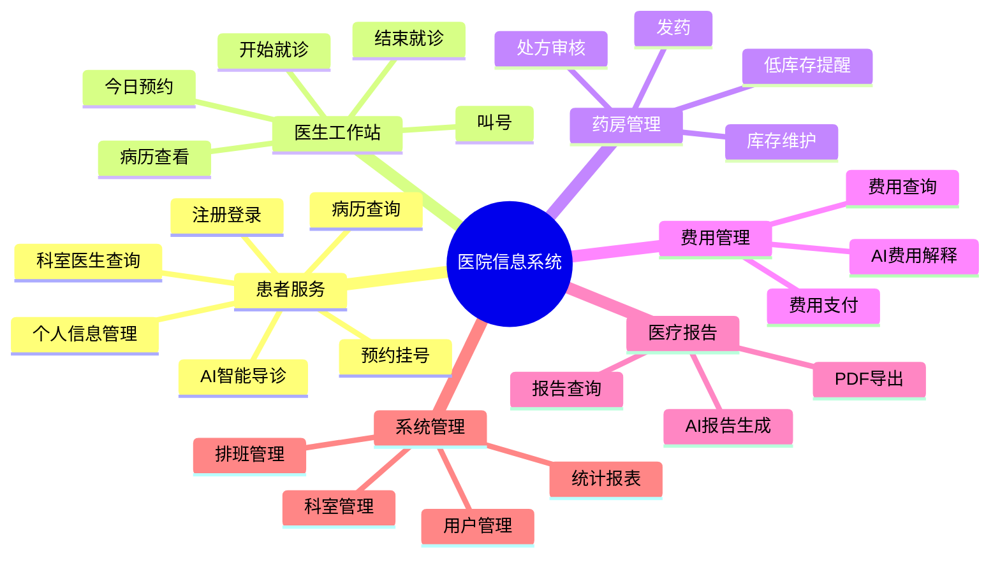
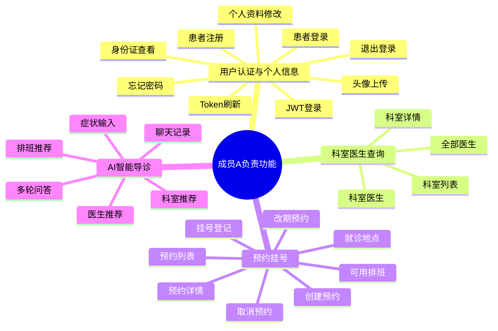
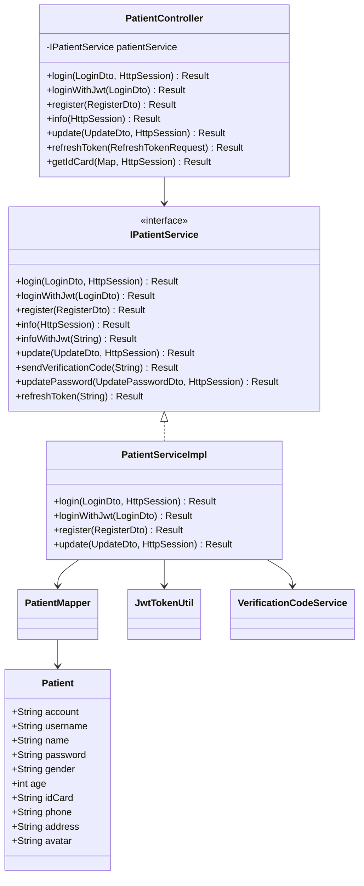
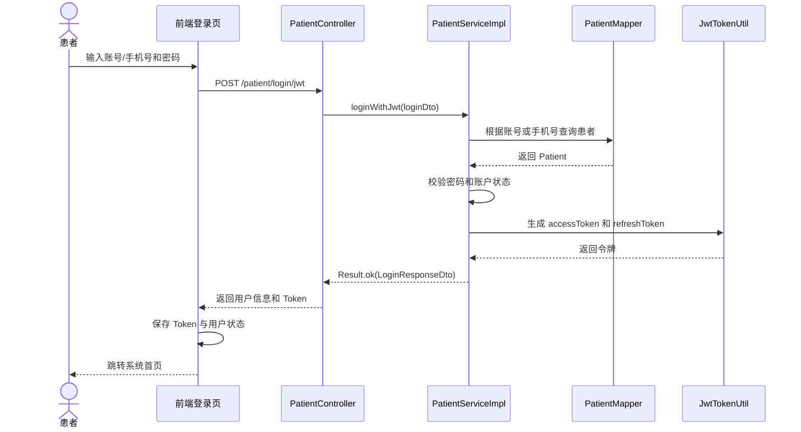
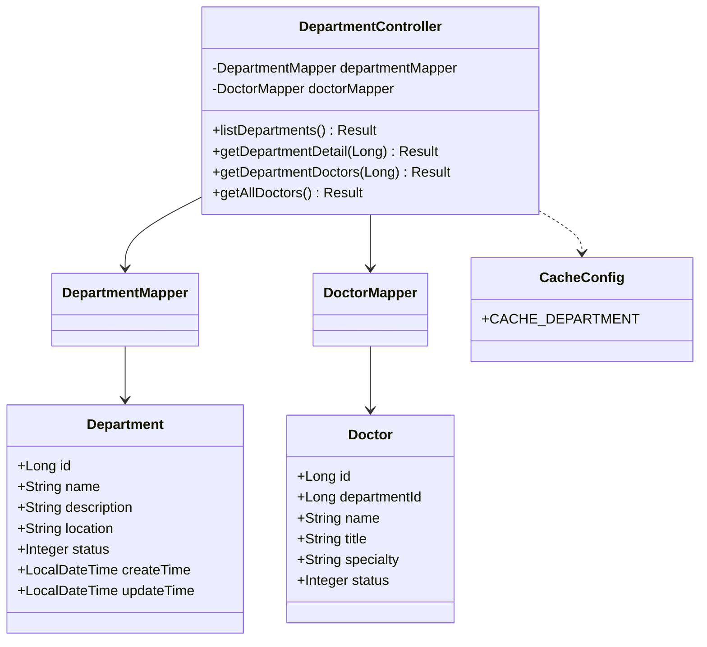
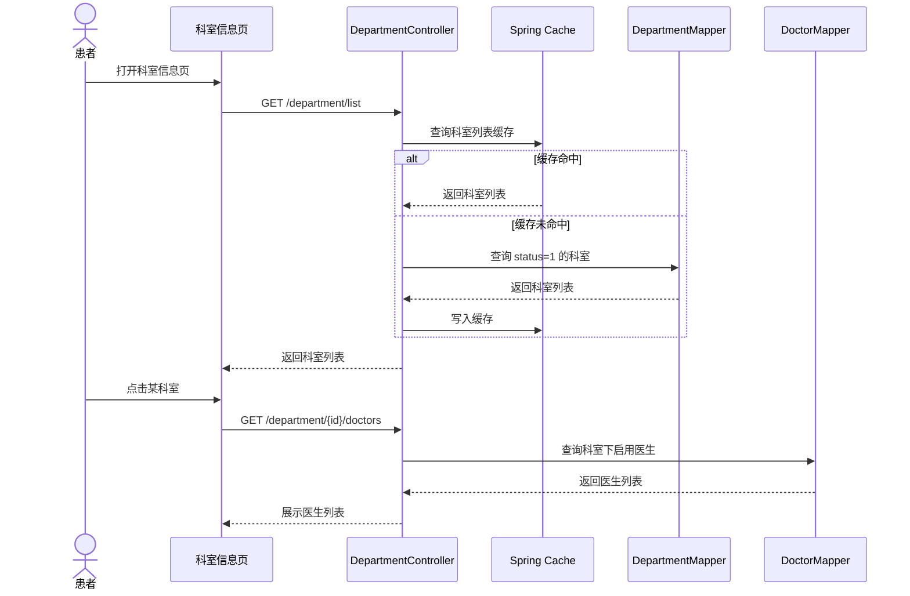
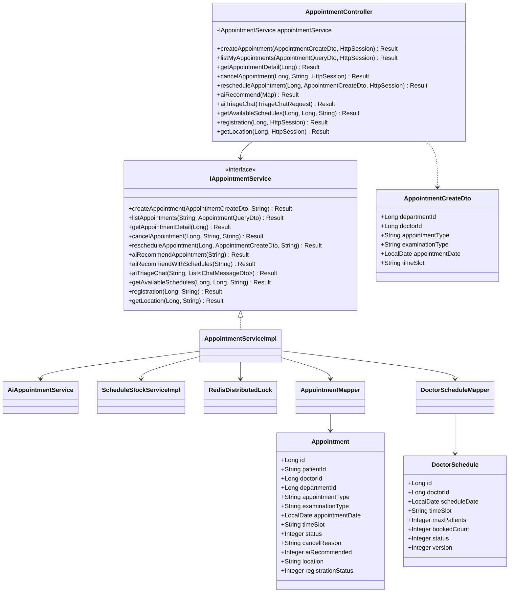
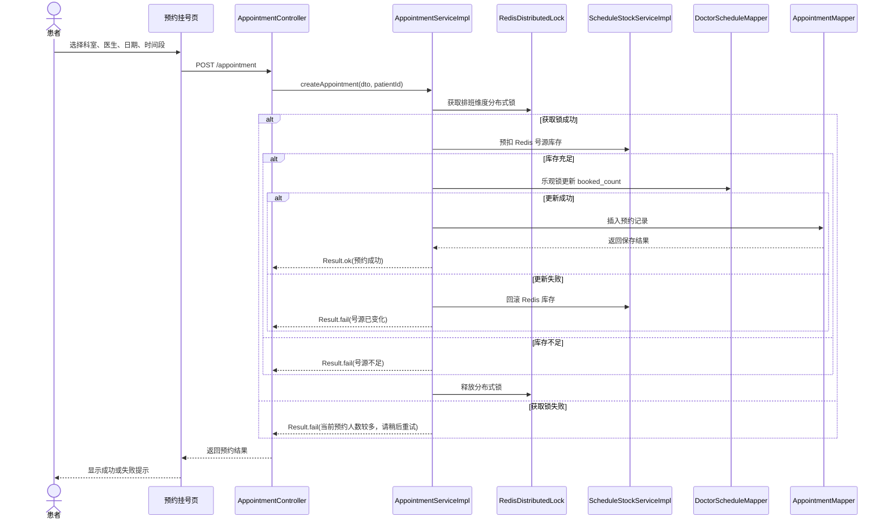
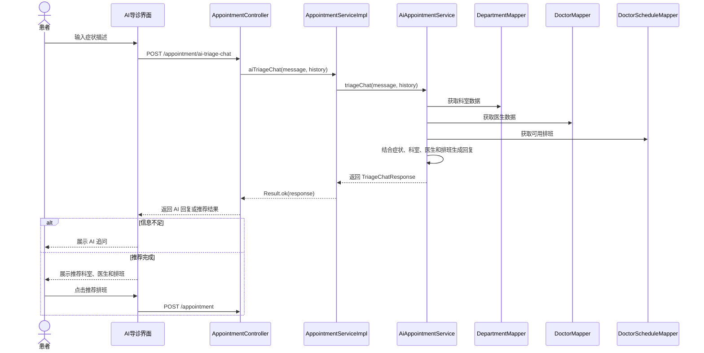
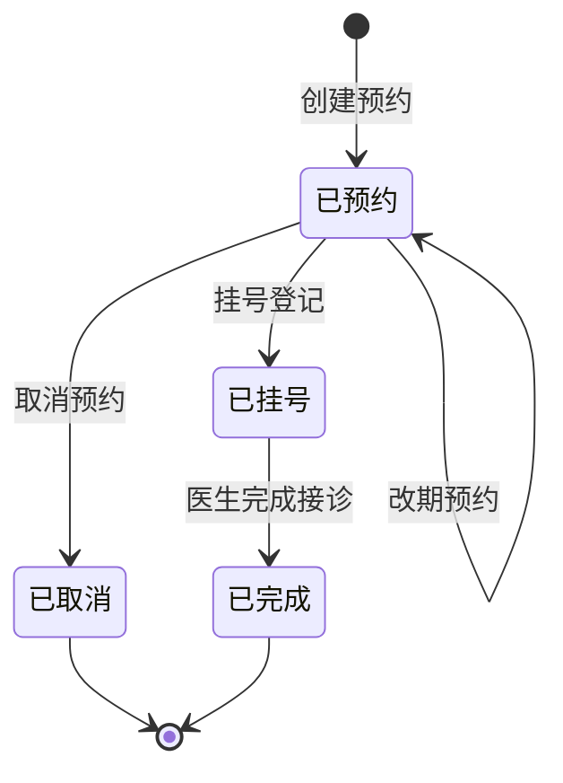

# 医院信息系统详细设计报告（成员A负责部分）

## 1 引言

### 1.1 编写目的

本报告依据医院信息系统（Hospital Information System，HIS）的需求分析结果和现有项目实现，对成员A负责的患者端核心业务进行详细设计说明。报告重点描述用户认证与个人信息管理、科室医生信息查询、预约挂号与 AI 智能导诊等模块的功能结构、交互界面、类及接口设计、核心业务流程和 UML 图，为后续编码维护、测试设计和课程验收提供依据。

### 1.2 项目背景

随着医院门诊服务线上化程度不断提高，传统人工挂号、人工导诊、纸质信息管理方式已经难以满足患者对便捷性、准确性和实时性的要求。本项目基于 Spring Boot + Vue 3 前后端分离架构，面向患者、医生、药师和管理员等角色，提供注册登录、科室查询、预约挂号、AI 导诊、病历查询、费用查询、报告生成、药房管理等功能。

成员A负责的部分主要面向患者就医入口，覆盖“登录系统、查询科室医生、完成预约挂号、使用 AI 导诊获取推荐”的完整前置就医流程。该部分直接影响用户使用系统的第一体验，也是后续医生接诊、费用结算和医疗报告生成等模块的数据来源。

### 1.3 参考文献

1. Ian Sommerville. Software Engineering, 10th Edition.
2. Grady Booch, James Rumbaugh, Ivar Jacobson. The Unified Modeling Language User Guide.
3. 《软件工程导论》，张海藩，清华大学出版社。
4. Spring Boot 官方文档：https://spring.io/projects/spring-boot
5. Vue 3 官方文档：https://vuejs.org/
6. MyBatis-Plus 官方文档：https://baomidou.com/
7. 项目源码：HospitalInformationSystem。

## 2 系统功能需求概要

### 2.1 系统总体功能

医院信息系统按照角色和业务流程可划分为患者服务、医护工作站、药房管理、费用管理、医疗报告和系统管理等功能域。成员A负责其中患者进入系统后的前置就医链路，主要包括：

1. 用户认证与个人信息管理：支持患者注册、登录、退出、Token 刷新、忘记密码、个人资料维护、身份证脱敏查看、头像上传等。
2. 科室与医生信息查询：支持查询科室列表、科室详情、科室医生列表、全部医生列表，为预约挂号提供基础信息。
3. 预约挂号管理：支持创建预约、预约列表查询、预约详情查看、取消预约、预约改期、查询可用排班、挂号登记和就诊地点查询。
4. AI 智能导诊：支持根据症状描述推荐科室、医生和可用排班，并支持多轮对话式导诊。
5. 聊天记录支撑：支持保存、查询、批量保存和清空 AI 导诊相关聊天记录。

### 2.2 总体功能分解图

### 2.3 成员A负责模块功能分解

## 3 用户认证与个人信息模块详细设计

### 3.1 功能模块概述

用户认证与个人信息模块负责患者账户生命周期管理，是患者访问系统受保护功能的入口。该模块主要实现患者注册、登录、退出登录、JWT 登录、Token 刷新、忘记密码、个人资料查询与修改、身份证号安全查看等功能。

系统同时保留 Session 登录和 JWT 登录两种模式。Session 模式用于兼容旧版本功能，JWT 模式用于前后端分离场景下的无状态认证。患者登录成功后，后端生成访问令牌或写入会话信息，前端保存用户状态，并在后续访问预约、病历、费用等功能时携带登录凭证。

### 3.2 用户交互界面设计

用户认证与个人信息模块主要涉及以下界面：

| 界面 | 主要控件 | 交互说明 |
|---|---|---|
| 登录界面 | 手机号/账号输入框、密码输入框、登录按钮、忘记密码入口 | 用户输入凭证后提交登录，成功后进入首页或原目标页面 |
| 注册界面 | 姓名、用户名、密码、确认密码、性别、年龄、手机号、地址、身份证号 | 前端进行基础校验，后端完成唯一性和格式校验 |
| 忘记密码界面 | 手机号、验证码、新密码、确认密码 | 用户获取验证码后提交新密码 |
| 个人信息界面 | 基本资料卡片、编辑表单、头像上传、身份证查看按钮 | 默认展示脱敏信息，敏感信息需验证密码后查看 |

### 3.3 类及接口细化设计

#### 3.3.1 主要类职责

| 类名 | 类型 | 职责 |
|---|---|---|
| `PatientController` | 控制器 | 接收患者账户和患者资料相关 HTTP 请求 |
| `IPatientService` | 服务接口 | 定义登录、注册、资料查询、资料修改等业务能力 |
| `PatientServiceImpl` | 服务实现 | 实现患者账户校验、密码加密、Token 生成、资料维护等逻辑 |
| `PatientMapper` | 数据访问 | 操作 `patient` 表 |
| `Patient` | 实体类 | 映射患者基础信息 |
| `LoginDto` | DTO | 封装登录请求参数 |
| `RegisterDto` | DTO | 封装注册请求参数 |
| `UpdateDto` | DTO | 封装个人信息修改参数 |
| `UpdatePasswordDto` | DTO | 封装忘记密码和重置密码参数 |
| `JwtTokenUtil` | 工具类 | 负责 JWT 生成、解析和校验 |
| `VerificationCodeService` | 工具服务 | 负责验证码生成、保存和校验 |

#### 3.3.2 核心接口

| 请求方法 | 接口路径 | 功能 |
|---|---|---|
| `POST` | `/patient/register` | 患者注册 |
| `POST` | `/patient/login` | Session 登录 |
| `POST` | `/patient/login/jwt` | JWT 登录 |
| `POST` | `/patient/loginout` | Session 退出 |
| `POST` | `/patient/loginout/jwt` | JWT 退出 |
| `POST` | `/patient/refresh-token` | 刷新 Token |
| `GET` | `/patient/me` | 查看当前用户信息 |
| `GET` | `/patient/me/jwt` | JWT 模式查看当前用户信息 |
| `PUT` | `/patient/me/update` | 修改个人信息 |
| `POST` | `/patient/login/send-code` | 发送验证码 |
| `PUT` | `/patient/login/forget` | 忘记密码 |
| `POST` | `/patient/id-card` | 验证密码后查看完整身份证号 |

#### 3.3.3 类图

### 3.4 登录时序图

### 3.5 异常与安全设计

1. 注册时校验手机号、身份证号、密码长度、确认密码一致性，避免无效账户进入系统。
2. 密码不以明文保存，后端使用加密方式存储和校验。
3. 身份证号默认脱敏展示，查看完整身份证号需要再次输入密码。
4. JWT 过期后可通过刷新令牌获取新的访问令牌。
5. 未登录用户访问受保护页面时，由前端路由守卫跳转登录页，后端拦截器进行二次校验。

## 4 科室与医生信息模块详细设计

### 4.1 功能模块概述

科室与医生信息模块为患者预约挂号和 AI 导诊提供基础数据。患者可以查看医院所有启用状态的科室，查看科室详情，查看科室下医生，也可以浏览全院医生列表。该模块的数据查询频率较高，但变更频率较低，因此在后端使用缓存注解对科室和医生列表进行缓存，提高响应速度。

### 4.2 用户交互界面设计

| 界面 | 主要控件 | 交互说明 |
|---|---|---|
| 科室信息页 | 科室列表、科室详情区、医生列表 | 用户点击科室后展示科室详情和该科室医生 |
| 预约挂号页 | 科室选择器、医生选择器、日期选择器 | 用户选择科室后加载医生和可用排班 |
| AI 导诊结果区 | 推荐科室卡片、推荐医生卡片、推荐排班列表 | 用户可根据推荐结果直接进入预约流程 |

### 4.3 类及接口细化设计

#### 4.3.1 主要类职责

| 类名 | 类型 | 职责 |
|---|---|---|
| `DepartmentController` | 控制器 | 提供科室和医生查询接口 |
| `DepartmentMapper` | 数据访问 | 查询科室信息 |
| `DoctorMapper` | 数据访问 | 查询医生信息 |
| `Department` | 实体类 | 映射科室表 |
| `Doctor` | 实体类 | 映射医生表 |
| `CacheConfig` | 配置类 | 定义科室缓存名称 |

#### 4.3.2 核心接口

| 请求方法 | 接口路径 | 功能 |
|---|---|---|
| `GET` | `/department/list` | 查询全部启用科室 |
| `GET` | `/department/{id}` | 查询科室详情 |
| `GET` | `/department/{id}/doctors` | 查询指定科室医生 |
| `GET` | `/department/doctors` | 查询全部医生 |

#### 4.3.3 类图

### 4.4 科室医生查询时序图

## 5 预约挂号与 AI 智能导诊模块详细设计

### 5.1 功能模块概述

预约挂号与 AI 智能导诊模块是患者端最核心的业务模块。患者既可以手动选择科室、医生、日期和时间段完成预约，也可以通过自然语言描述症状，由 AI 推荐合适科室、医生和可用排班。

预约业务需要处理号源并发问题。系统在创建预约时结合 Redis 分布式锁、Redis 号源缓存和数据库乐观锁，避免多人同时预约同一医生同一时段时出现超号问题。预约创建后，患者可查询预约列表和详情，也可取消或改期。挂号登记后，系统可返回就诊地点，为患者线下就诊提供指引。

### 5.2 用户交互界面设计

| 界面区域 | 主要控件 | 交互说明 |
|---|---|---|
| 手动预约区 | 科室选择、医生选择、日期选择、时间段选择、预约按钮 | 患者逐步选择预约条件并提交 |
| AI 导诊区 | 对话消息列表、症状输入框、发送按钮、推荐结果卡片 | 患者输入症状，AI 追问或给出推荐 |
| 预约列表区 | 预约表格、状态筛选、日期筛选、取消按钮、改期按钮 | 患者查看和管理已有预约 |
| 排班展示区 | 医生、日期、时间段、剩余号源、状态 | 展示可预约排班，满号或停诊不可选 |
| 就诊信息区 | 预约详情、挂号状态、就诊地点 | 预约成功后查看就诊指引 |

### 5.3 类及接口细化设计

#### 5.3.1 主要类职责

| 类名 | 类型 | 职责 |
|---|---|---|
| `AppointmentController` | 控制器 | 接收预约、取消、改期、AI 推荐等请求 |
| `IAppointmentService` | 服务接口 | 定义预约挂号核心业务方法 |
| `AppointmentServiceImpl` | 服务实现 | 实现预约创建、取消、改期、排班查询和挂号登记 |
| `AiAppointmentService` | AI 服务 | 根据症状生成导诊推荐和多轮对话回复 |
| `ScheduleStockServiceImpl` | 服务实现 | 维护 Redis 中的排班号源库存 |
| `RedisDistributedLock` | 工具类 | 提供分布式锁能力 |
| `AppointmentMapper` | 数据访问 | 操作预约表 |
| `DoctorScheduleMapper` | 数据访问 | 操作医生排班表 |
| `Appointment` | 实体类 | 映射预约信息 |
| `DoctorSchedule` | 实体类 | 映射医生排班信息 |
| `AppointmentCreateDto` | DTO | 封装创建预约和改期请求 |
| `AppointmentQueryDto` | DTO | 封装预约查询筛选条件 |
| `TriageChatRequest` | DTO | 封装 AI 导诊对话请求 |

#### 5.3.2 核心接口

| 请求方法 | 接口路径 | 功能 |
|---|---|---|
| `POST` | `/appointment` | 创建预约 |
| `GET` | `/appointment/list` | 查询当前患者预约列表 |
| `GET` | `/appointment/{id}` | 查询预约详情 |
| `PUT` | `/appointment/{id}/cancel` | 取消预约 |
| `PUT` | `/appointment/{id}/reschedule` | 改期预约 |
| `GET` | `/appointment/schedules` | 查询可用排班 |
| `POST` | `/appointment/{id}/registration` | 挂号登记 |
| `POST` | `/appointment/frontdesk/registration` | 前台现场挂号 |
| `GET` | `/appointment/{id}/location` | 查询就诊地点 |
| `POST` | `/appointment/ai-recommend` | AI 推荐科室/医生 |
| `POST` | `/appointment/ai-recommend-with-schedules` | AI 推荐并返回可用排班 |
| `POST` | `/appointment/ai-triage-chat` | 多轮 AI 导诊对话 |

#### 5.3.3 类图

### 5.4 创建预约时序图

### 5.5 AI 智能导诊时序图

### 5.6 预约状态设计

预约对象 `Appointment` 中使用 `status` 表示预约状态，使用 `registrationStatus` 表示挂号登记状态。

| 字段 | 取值 | 含义 |
|---|---|---|
| `status` | `0` | 已预约 |
| `status` | `1` | 已完成 |
| `status` | `2` | 已取消 |
| `registrationStatus` | `0` 或空 | 未挂号 |
| `registrationStatus` | `1` | 已挂号 |

状态转换如下：

### 5.7 异常与并发控制设计

1. 参数校验：创建预约时必须包含科室 ID、预约类型、预约日期和时间段；医生预约场景下应包含医生 ID。
2. 重复预约控制：同一患者同一天同一时段不允许重复预约。
3. 号源并发控制：通过 Redis 分布式锁保证同一排班创建预约过程互斥。
4. 库存预扣：Redis 中维护排班剩余号源，创建预约前先进行预扣，失败时回滚。
5. 数据库一致性：医生排班表使用 `version` 字段进行乐观锁控制，防止数据库层面超号。
6. 取消预约处理：取消成功后释放号源，更新预约状态和取消原因。
7. 改期处理：先释放原预约号源，再占用新排班号源，保证新旧预约状态一致。
8. AI 输入校验：症状描述为空时直接返回错误提示，避免无效 AI 调用。

## 6 成员A负责内容总结

成员A负责的用户认证、科室医生查询、预约挂号与 AI 导诊模块构成患者端就医前置流程。用户认证模块保证患者身份可信和敏感信息安全；科室医生模块提供挂号基础信息；预约挂号模块完成实际号源占用和就诊登记；AI 导诊模块通过自然语言交互降低患者选择科室和医生的难度。

从详细设计角度看，本部分重点体现了以下设计思想：

1. 分层架构清晰：控制器负责请求接收，服务层负责业务逻辑，Mapper 负责数据访问。
2. 数据对象明确：实体类映射数据库表，DTO 封装请求参数，Result 统一响应格式。
3. 并发控制完善：预约挂号使用 Redis 分布式锁、Redis 库存预扣和数据库乐观锁共同防止超号。
4. 安全设计合理：登录认证、密码加密、身份证脱敏、Token 刷新机制共同保护用户信息。
5. 智能化体验突出：AI 导诊将症状输入、科室推荐、医生推荐和排班推荐整合为连续交互流程。
