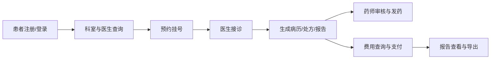
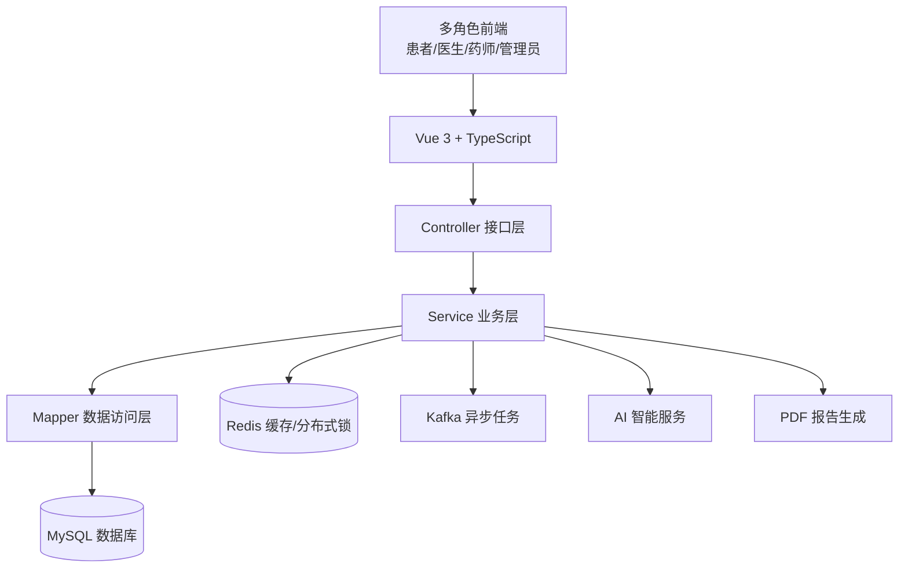
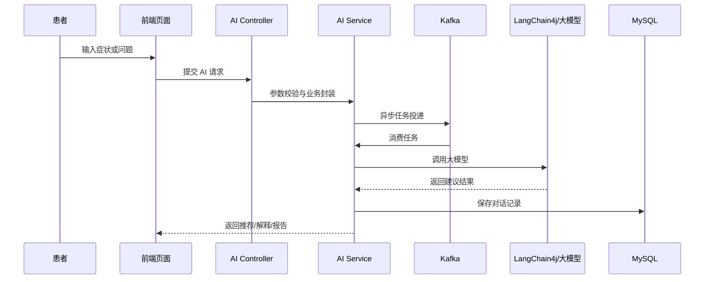

# 医院信息系统（HIS）项目 PPT 制作方案

> 适用场景：课程设计汇报、软件工程项目答辩、系统展示、测试实验汇报。
> 建议页数：10-14 页。
> 建议时长：8-12 分钟。

---

## 一、PPT 制作思路

这个项目的 PPT 不建议只罗列功能，而应该按照“项目背景 -> 系统目标 -> 技术架构 -> 核心功能 -> 关键实现 -> 测试验证 -> 总结展望”的逻辑来讲。

推荐主线：

1. 医院信息化场景中存在挂号、就诊、开药、缴费、报告、管理等多角色协同问题。
2. 本项目通过前后端分离架构，构建一个面向患者、医生、药师、管理员的综合医院信息系统。
3. 系统不仅覆盖基础 HIS 流程，还加入 AI 导诊、AI 药品推荐、AI 费用解释、医疗报告生成等智能化能力。
4. 后端使用 Spring Boot + MyBatis-Plus + MySQL + Redis + Kafka，前端使用 Vue 3 + TypeScript + Element Plus。
5. 项目通过接口测试、单元测试、集成测试和 Selenium 自动化测试验证主要业务流程。

---

## 二、推荐 PPT 目录

1. 项目封面
2. 项目背景与建设目标
3. 系统用户与业务流程
4. 总体功能模块
5. 技术栈与开发环境
6. 系统总体架构
7. 数据库与核心实体设计
8. 核心业务功能展示
9. AI 智能服务设计
10. 安全认证与权限控制
11. 缓存、异步与并发处理
12. 测试方案与测试结果
13. 项目亮点与不足
14. 总结与展望

---

## 第 1 页：项目封面

### 标题

医院信息系统（Hospital Information System）

### 副标题

基于 Spring Boot 与 Vue 3 的综合医疗服务平台

### 页面内容

- 项目名称：Hospital Information System
- 技术方向：前后端分离、医疗信息管理、AI 辅助服务
- 汇报人：填写姓名
- 日期：填写答辩日期

### 设计建议

封面可以使用医院、医疗、数据看板、电子病历等相关背景图。标题要突出“HIS”和“综合医疗服务平台”。

---

## 第 2 页：项目背景与建设目标

### 页面标题

项目目标：让医院核心服务流程线上化、智能化、角色化

### 主要内容

传统医院服务中常见问题：

- 患者挂号、缴费、报告查询流程分散。
- 医生、药师、管理员之间业务协作成本较高。
- 药品库存、处方审核、费用明细等信息需要统一管理。
- 患者对科室选择、药品说明、费用构成存在理解门槛。

本项目建设目标：

- 构建患者、医生、药师、管理员多角色协同平台。
- 实现预约挂号、病历管理、药品查询、费用查询、报告生成等核心功能。
- 引入 AI 导诊、AI 药品推荐、AI 费用解释，提高系统智能化水平。
- 使用统一认证、异常处理、缓存和异步任务机制提升系统可用性。

### 可视化建议

左侧放“传统问题”，右侧放“系统解决方案”，中间用箭头连接。

---

## 第 3 页：系统用户与业务流程

### 页面标题

系统围绕患者就医全流程展开

### 角色划分

- 患者：注册登录、预约挂号、查看病历、查询药品、查看费用、生成报告。
- 医生：查看预约、叫号、开始就诊、结束就诊、查看患者病历。
- 药师：处方审核、处方拒绝、发药、库存管理、低库存提醒。
- 管理员：用户管理、科室管理、医生排班、系统配置、运营统计。

### 业务流程



### 讲解要点

这一页重点说明项目不是单一页面功能，而是覆盖“预约-就诊-处方-药品-费用-报告”的完整医疗业务链路。

---

## 第 4 页：总体功能模块

### 页面标题

系统功能覆盖患者端、医护端与管理端

### 功能模块

患者端：

- 用户注册、登录、忘记密码、个人资料维护
- 科室查询、医生查询、预约挂号
- 病历查询、费用查询、药品查询
- AI 导诊、AI 药品推荐、AI 费用解释
- 医疗报告生成、确认与 PDF 导出

医生端：

- 今日预约查看
- 患者叫号
- 开始/结束就诊
- 患者历史病历查看

药师端：

- 待审核处方查询
- 处方审核与拒绝
- 发药管理
- 药品库存与库存流水管理

管理员端：

- 运营统计
- 用户管理
- 科室管理
- 医生排班管理
- 系统配置维护

### 可视化建议

使用四象限布局：患者端、医生端、药师端、管理员端。每个象限列出 3-5 个关键功能。

---

## 第 5 页：技术栈与开发环境

### 页面标题

前后端分离技术栈支撑系统扩展

### 后端技术

- Java 21
- Spring Boot 3.2.5
- MyBatis-Plus
- MySQL 8
- Redis
- Kafka
- JWT
- Spring Security Crypto
- LangChain4j
- iText PDF

### 前端技术

- Vue 3
- TypeScript
- Vite
- Pinia
- Vue Router
- Axios
- Element Plus
- ECharts

### 测试与工程化

- JUnit / Spring Boot Test
- Selenium 自动化测试
- Postman 接口测试
- Maven 后端构建
- npm / Vite 前端构建

### 可视化建议

做成三列：前端、后端、测试与运维。每列配对应技术图标或标签。

---

## 第 6 页：系统总体架构

### 页面标题

系统采用典型分层架构，降低模块耦合

### 架构说明

系统主要分为：

- 前端展示层：Vue 页面、路由、状态管理、接口封装。
- Controller 层：接收 HTTP 请求，完成参数校验与业务转发。
- Service 层：处理核心业务逻辑、权限判断、事务控制。
- Mapper 层：通过 MyBatis-Plus 访问数据库。
- 数据持久层：MySQL 存储用户、预约、病历、处方、费用、库存等数据。
- 基础能力层：Redis 缓存与分布式锁、Kafka 异步任务、AI 服务、PDF 生成。

### 架构图



### 讲解要点

这一页可以强调：项目结构清晰，Controller、Service、Mapper、Entity、DTO 分层明确，方便维护和扩展。

---

## 第 7 页：数据库与核心实体设计

### 页面标题

核心实体围绕医疗服务链路建模

### 核心实体

- User / Patient：用户与患者信息
- Doctor / Department / DoctorSchedule：医生、科室与排班
- Appointment：预约挂号记录
- MedicalRecord / VisitRecord：病历与就诊记录
- Prescription / PrescriptionItem / PrescriptionAudit：处方、处方明细与审核
- Medicine / MedicineInventory / MedicineStockLog：药品、库存与库存流水
- Billing：费用账单
- MedicalReport：医疗报告
- ChatHistory：AI 对话记录
- SystemConfig：系统配置

### 设计说明

- 预约模块连接患者、医生、排班信息。
- 就诊模块连接预约、医生、病历和处方。
- 药品模块连接处方审核、库存变化和发药流程。
- 费用模块连接患者、账单、支付状态和 AI 费用解释。
- AI 模块通过 ChatHistory 保存多轮对话上下文。

### 可视化建议

用 ER 图或“患者 -> 预约 -> 就诊 -> 处方/费用/报告”的链路图展示。

---

## 第 8 页：核心业务功能展示

### 页面标题

系统实现从挂号到报告的闭环服务

### 重点展示功能

1. 登录与权限入口
   - 患者、医生、药师、管理员进入不同页面。
   - 使用 JWT 实现登录态和接口保护。

2. 预约挂号
   - 查询科室和医生。
   - 根据医生排班创建预约。
   - 支持预约列表、详情、取消、改期和挂号确认。

3. 医生工作台
   - 医生查看今日预约。
   - 叫号、开始就诊、结束就诊。
   - 查看患者历史病历。

4. 药师工作台
   - 审核处方。
   - 拒绝不合规处方。
   - 发药并更新库存。
   - 查看低库存药品与库存流水。

5. 管理员控制台
   - 查看运营统计。
   - 管理用户、科室、医生排班和系统配置。

### 可视化建议

可以放系统截图：登录页、预约页、医生工作台、药师工作台、管理员统计页。

---

## 第 9 页：AI 智能服务设计

### 页面标题

AI 能力提升患者自助服务体验

### AI 功能

- AI 导诊：根据症状推荐科室、医生和预约时间。
- AI 药品推荐：根据症状给出药品建议、推荐理由和用药注意事项。
- AI 费用解释：帮助患者理解费用构成。
- AI 医疗报告生成：根据就诊信息生成结构化医疗报告。
- 多轮对话记录：保存患者与 AI 的交互历史。

### 技术实现

- 后端通过 LangChain4j 接入大模型能力。
- 对话请求由 Controller 接收后转发到 AI Service。
- 部分 AI 任务支持 Kafka 异步处理，避免长时间阻塞请求。
- ChatHistory 保存聊天上下文，支持后续查询和追踪。

### 流程图



---

## 第 10 页：安全认证与权限控制

### 页面标题

系统通过 JWT 与角色隔离保护业务数据

### 安全设计

- JWT 登录认证：用户登录成功后返回 Token。
- Token 刷新机制：支持登录状态续期。
- 路由与接口权限控制：不同角色访问不同页面和接口。
- 密码加密：使用 Spring Security Crypto 进行密码处理。
- 统一异常返回：未登录、无权限、参数错误等情况返回统一格式。
- 文件上传校验：限制头像文件类型与大小。

### 角色隔离

- 患者只能访问自己的病历、费用、报告等信息。
- 医生只能访问与接诊相关的患者信息。
- 药师只能处理处方审核、发药和库存相关业务。
- 管理员拥有系统配置、用户管理、统计查询等后台权限。

### 可视化建议

用“请求 -> JWT 校验 -> 角色判断 -> 业务处理 -> 返回结果”的流程图。

---

## 第 11 页：缓存、异步与并发处理

### 页面标题

Redis 与 Kafka 提升系统性能和稳定性

### Redis 使用场景

- 会话与登录状态辅助缓存。
- 热点数据缓存，减少数据库访问。
- 分布式锁，处理预约、库存等并发场景。

### Kafka 使用场景

- AI 异步任务处理。
- 将耗时任务从同步请求中拆分出去。
- 提高接口响应速度和系统吞吐能力。

### 并发控制示例

- 预约挂号需要避免同一排班号源被重复预约。
- 药品发药需要避免库存被并发扣减到负数。
- 使用 Redis 分布式锁保障关键业务操作的原子性。

### 可视化建议

放一张“同步请求”和“异步任务”的对比图，突出用户体验提升。

---

## 第 12 页：测试方案与测试结果

### 页面标题

多层测试保障系统主要流程可用

### 测试类型

- 单元测试：验证 Service 层业务逻辑。
- 集成测试：验证 Controller、Service、Mapper 与数据库协作。
- 接口测试：使用 Postman 测试 REST API。
- 自动化测试：使用 Selenium 覆盖登录、预约、查询、工作台等流程。
- 性能与缓存测试：验证 Redis 缓存对查询效率的提升。

### 测试重点

- 登录认证与 Token 失效处理。
- 预约挂号状态流转。
- 医生叫号与就诊流程。
- 药师处方审核与发药流程。
- 费用查询、报告生成和 PDF 导出。
- AI 服务异常输入和接口可用性。

### 可视化建议

可以放测试用例表格、自动化测试截图、测试报告截图或接口测试结果截图。

---

## 第 13 页：项目亮点与不足

### 页面标题

项目亮点：完整业务链路 + AI 能力 + 工程化验证

### 项目亮点

- 多角色协同：覆盖患者、医生、药师、管理员四类用户。
- 业务闭环完整：从预约、就诊、处方、发药、缴费到报告形成完整链路。
- AI 融合：导诊、药品推荐、费用解释、报告生成提升智能化程度。
- 架构清晰：前后端分离，后端采用 Controller-Service-Mapper 分层。
- 工程实践完善：包含接口文档、开发文档、测试报告和自动化测试。
- 并发与异步处理：使用 Redis 分布式锁和 Kafka 异步任务增强系统稳定性。

### 当前不足

- AI 推荐结果需要更多真实医疗数据验证。
- 部分业务规则仍可进一步细化，例如处方审核规则、排班冲突处理规则。
- 系统可以继续完善日志追踪、监控告警和部署自动化。
- 前端可以进一步优化移动端适配和无障碍体验。

---

## 第 14 页：总结与展望

### 页面标题

总结：本项目完成了一个可扩展的综合医院信息管理平台

### 总结

本项目基于 Spring Boot 和 Vue 3 实现了医院信息系统的核心业务功能，覆盖患者端、医生端、药师端和管理员端。系统通过 MySQL 完成业务数据持久化，通过 Redis 提升缓存和并发控制能力，通过 Kafka 支持异步任务处理，并结合 LangChain4j 引入 AI 导诊、药品推荐和报告生成等智能服务。

### 展望

后续可以从以下方向继续优化：

- 增加更完善的电子病历和检查检验模块。
- 接入真实医院数据接口或标准医疗数据规范。
- 加强 AI 结果审核机制，提高医疗建议可靠性。
- 增加系统监控、日志追踪和容器化部署。
- 优化前端交互体验，提升系统易用性。

### 结束语

感谢各位老师和同学的观看，欢迎提出建议。

---

## 三、现场演示建议

如果答辩时需要演示系统，建议按以下顺序操作：

1. 打开首页，介绍系统定位。
2. 使用患者账号登录，演示科室查询和预约挂号。
3. 演示 AI 导诊或 AI 药品推荐。
4. 切换医生账号，演示今日预约、叫号和就诊流程。
5. 切换药师账号，演示处方审核、发药和库存管理。
6. 切换管理员账号，演示统计数据和系统配置。
7. 展示测试报告或接口文档，证明系统经过验证。

演示时不要展示所有功能，重点选 3-4 条完整业务链路，讲清楚“用户为什么需要、系统如何处理、技术上怎么实现”。

---

## 四、答辩问题准备

### 1. 为什么采用前后端分离？

前后端分离可以让前端专注页面展示和交互，后端专注业务接口和数据处理，降低耦合度，也方便后续扩展移动端、小程序或第三方系统接入。

### 2. 为什么使用 JWT？

JWT 适合前后端分离项目，可以在无状态接口中传递用户身份信息。系统通过 Token 判断用户是否登录，并结合角色信息控制接口访问权限。

### 3. Redis 在项目中解决什么问题？

Redis 主要用于缓存、会话辅助和分布式锁。对于预约挂号、库存扣减等存在并发风险的场景，可以通过分布式锁降低重复预约和库存错误的风险。

### 4. Kafka 为什么适合 AI 异步任务？

AI 请求可能耗时较长，如果全部同步处理会影响接口响应。Kafka 可以将任务投递到消息队列中异步消费，提高用户体验和系统吞吐能力。

### 5. AI 功能如何保证可靠性？

目前系统主要通过输入校验、结构化返回、异常处理和结果展示来保障基础可用性。后续可以加入人工审核、知识库约束、医学规则校验和结果置信度提示。

### 6. 系统如何保证不同角色的数据安全？

系统通过登录认证、JWT 校验和角色权限判断实现隔离。不同角色只能访问对应业务接口，例如患者访问个人信息，医生访问接诊相关数据，药师访问处方和库存数据，管理员访问后台管理功能。

---

## 五、PPT 视觉设计建议

### 风格

- 医疗科技风：白色、浅蓝、深蓝、绿色作为主色。
- 页面保持简洁，避免一页放太多文字。
- 重点页面使用流程图、架构图、模块图替代长段落。

### 推荐配色

- 主色：#2563EB
- 辅色：#10B981
- 深色文字：#111827
- 浅色背景：#F8FAFC
- 警示色：#F59E0B

### 推荐页面素材

- 系统首页截图
- 登录页面截图
- 预约挂号页面截图
- 医生工作台截图
- 药师工作台截图
- 管理员统计页面截图
- 测试报告截图
- 架构图和业务流程图

---

## 六、可选：用 Markdown 生成 PPT

如果想把这个 Markdown 改造成可直接生成 PPT 的格式，可以使用 Marp。

安装：

```bash
npm install -g @marp-team/marp-cli
```

生成 PPTX：

```bash
marp ppt.md --pptx
```

生成 PDF：

```bash
marp ppt.md --pdf
```

如果用 Marp，建议在每一页之间使用 `---` 作为分页符，并将内容进一步压缩为“标题 + 3-5 个要点 + 一张图”。
