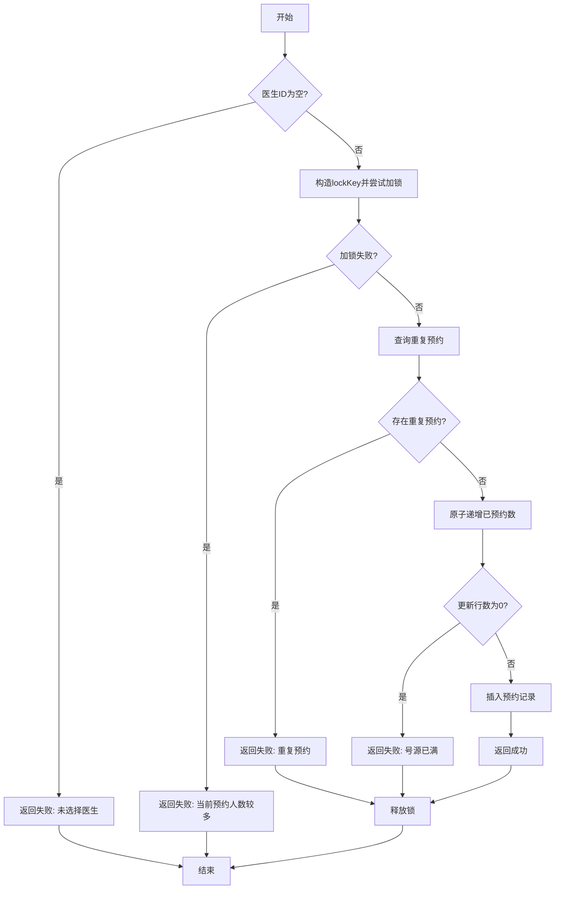
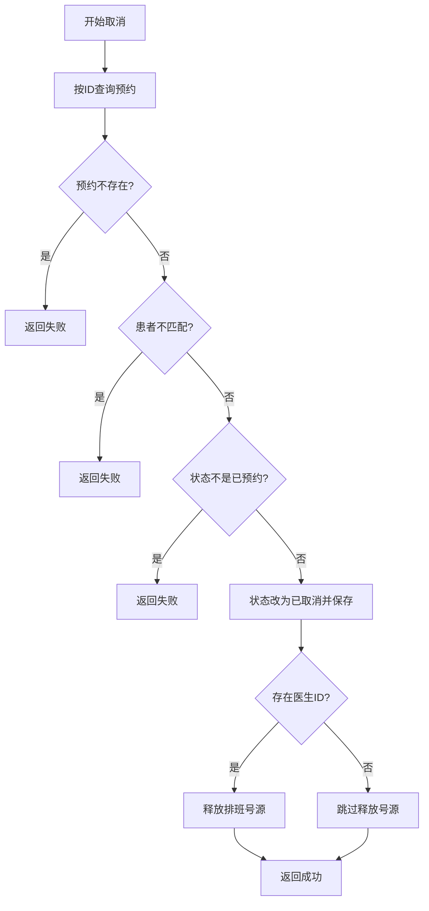
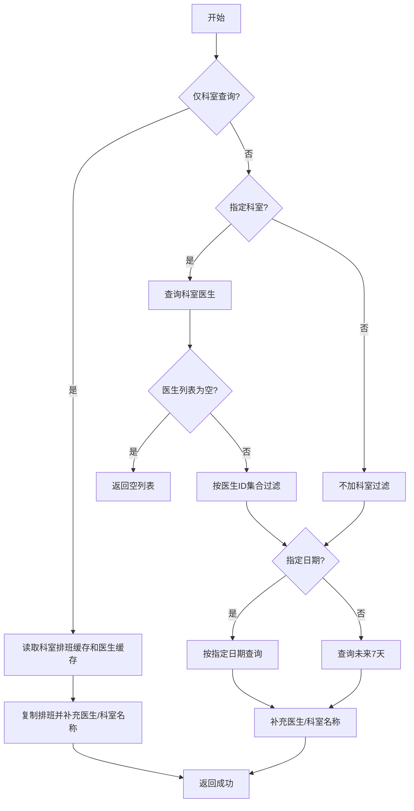
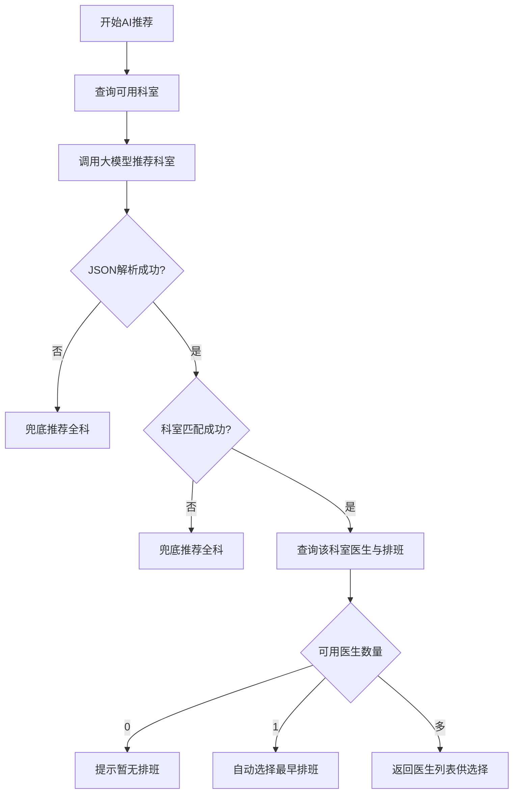

# 学生B白盒测试报告：预约与AI导诊模块

## 1. 测试范围

| 学生 | 功能单元 | 代码单元 | 白盒测试方法 |
|---|---|---|---|
| 学生B | 预约创建 | `AppointmentServiceImpl.createAppointment` | 语句覆盖、判定覆盖、边界/异常路径覆盖 |
| 学生B | 预约取消与改期 | `AppointmentServiceImpl.cancelAppointment`、`rescheduleAppointment` | 语句覆盖、判定覆盖、边界/异常路径覆盖 |
| 学生B | 科室/医生/排班查询与AI导诊 | `AppointmentServiceImpl.getAvailableSchedules`、`AiAppointmentService.recommendWithSchedules`、`triageChat` | 语句覆盖、判定覆盖、边界/异常路径覆盖 |

## 2. 测试环境

| 项目 | 内容 |
|---|---|
| 操作系统 | Windows |
| JDK | Java 21 |
| 构建工具 | Maven |
| 单元测试框架 | JUnit 5 |
| Mock工具 | Mockito |
| 覆盖率工具 | JaCoCo，可用 `mvn test jacoco:report` 扩展执行 |
| 静态分析工具 | SpotBugs，可按实验环境扩展 Maven 插件 |

## 3. 单元一：预约创建

### 3.1 代码逻辑

目标方法：`AppointmentServiceImpl.createAppointment(AppointmentCreateDto dto, String patientId)`

主要判定：

| 编号 | 判定/条件 | True分支 | False分支 |
|---|---|---|---|
| C1 | `dto.getDoctorId() == null` | 返回失败，不加锁 | 继续构造锁 |
| C2 | `distributedLock.tryLock(lockKey) == null` | 返回繁忙失败 | 进入锁保护逻辑 |
| C3 | `existCount > 0` | 返回重复预约失败 | 尝试扣减号源 |
| C4 | `incrementBookedCount(...) == 0` | 返回号源已满失败 | 插入预约记录 |

### 3.2 控制流图



圈复杂度：判定节点 4 个，V(G)=4+1=5。

### 3.3 基本路径与测试用例

| 路径编号 | 路径 | 测试数据 | 预期结果 | 对应测试方法 |
|---|---|---|---|---|
| P1 | A-B(T)-F1-Z | `doctorId=null` | 返回失败，未尝试加锁 | `createRejectsMissingDoctor` |
| P2 | A-B(F)-C-D(T)-F2-Z | 锁返回 `null` | 返回失败，不查重不扣号 | `createRejectsWhenLockBusy` |
| P3 | A-B(F)-C-D(F)-E-G(T)-F3-U-Z | `existCount=1` | 返回重复预约失败并释放锁 | `createRejectsDuplicateAppointment` |
| P4 | A-B(F)-C-D(F)-E-G(F)-H-I(T)-F4-U-Z | 扣号返回 `0` | 返回号源已满并释放锁 | `createRejectsFullSchedule` |
| P5 | A-B(F)-C-D(F)-E-G(F)-H-I(F)-J-K-U-Z | 无重复，扣号成功 | 插入预约，返回成功并释放锁 | `createSucceedsWhenAllConditionsPass` |

## 4. 单元二：预约取消与改期

### 4.1 代码逻辑

目标方法：`cancelAppointment`、`rescheduleAppointment`

主要判定：

| 编号 | 判定/条件 | True分支 | False分支 |
|---|---|---|---|
| C1 | `appointment == null` | 返回预约不存在 | 继续校验归属 |
| C2 | `!appointment.getPatientId().equals(patientId)` | 返回无权操作 | 继续校验状态 |
| C3 | `appointment.getStatus() != 0` | 返回只能取消已预约状态 | 更新取消状态 |
| C4 | `appointment.getDoctorId() != null` | 释放排班号源 | 不释放号源 |
| C5 | `cancelResult.getSuccess()` | 创建新预约 | 返回取消失败结果 |

### 4.2 控制流图



取消方法圈复杂度：判定节点 4 个，V(G)=5。改期方法新增 1 个取消结果判定，V(G)=2。

### 4.3 基本路径与测试用例

| 路径编号 | 路径 | 测试数据 | 预期结果 | 对应测试方法 |
|---|---|---|---|---|
| P1 | 查询为空 | `selectById=null` | 返回失败，不更新预约 | `cancelRejectsMissingAppointment` |
| P2 | 非本人预约 | `patientId=other-patient` | 返回失败，不更新预约 | `cancelRejectsNonOwner` |
| P3 | 状态非0 | `status=1` | 返回失败，不释放号源 | `cancelRejectsWrongStatus` |
| P4 | 合法取消且有医生 | `status=0, doctorId=20` | 状态改为2，释放号源 | `cancelSucceedsAndReleasesScheduleWithLock` |
| P5 | 改期时取消失败 | 旧预约不存在 | 停止流程，不创建新预约 | `rescheduleStopsWhenCancelFails` |
| P6 | 改期成功 | 取消成功，新号源可用 | 更新旧预约并插入新预约 | `rescheduleCancelsThenCreatesNewAppointment` |

## 5. 单元三：排班查询与AI导诊

### 5.1 代码逻辑

目标方法：`getAvailableSchedules`、`recommendWithSchedules`、`triageChat`

主要判定：

| 编号 | 判定/条件 | True分支 | False分支 |
|---|---|---|---|
| C1 | 仅按科室查询，且医生和日期为空 | 走缓存查询分支 | 走数据库条件查询 |
| C2 | 科室下医生列表为空 | 返回空列表 | 按医生ID查询排班 |
| C3 | 日期字符串非空 | 按指定日期查询 | 查询未来7天 |
| C4 | AI JSON解析失败 | 返回兜底推荐 | 继续匹配科室 |
| C5 | 科室匹配失败 | 返回兜底推荐 | 查询医生和排班 |
| C6 | 可用医生数为0/1/多 | 无可用排班/自动选医生/需要患者选择 | 构造不同推荐结果 |
| C7 | `triageChat` 中 `completed` | 构造完整推荐 | 返回继续追问 |

### 5.2 控制流图：排班查询



圈复杂度：判定节点 4 个，V(G)=5。

### 5.3 控制流图：AI推荐与导诊



圈复杂度：判定节点 4 个，V(G)=5。

### 5.4 基本路径与测试用例

| 路径编号 | 覆盖目标 | 测试数据 | 预期结果 | 对应测试方法 |
|---|---|---|---|---|
| P1 | 科室缓存分支 | `departmentId=10, doctorId=null, date=""` | 返回复制后的排班，补充医生/科室名 | `departmentOnlyQueryUsesCacheBranch` |
| P2 | 科室无医生分支 | 科室医生列表为空 | 返回空列表 | `directQueryReturnsEmptyWhenDepartmentHasNoDoctors` |
| P3 | 指定日期分支 | `date=2026-06-20` | 查询并补充排班名称 | `directDateQueryFillsNames` |
| P4 | 异常路径 | `date=2026/06/20` | 抛出日期解析异常 | `invalidDateThrowsParseException` |
| P5 | AI单医生分支 | AI返回 Internal，1名医生有排班 | 自动选择医生和最早时段 | `oneAvailableDoctorIsSelectedAutomatically` |
| P6 | AI多医生分支 | AI返回 Internal，2名医生有排班 | `needChooseDoctor=true` | `multipleDoctorsRequireChoice` |
| P7 | AI无排班分支 | 科室匹配但排班为空 | 返回科室，无需选择医生 | `noAvailableScheduleReturnsDepartmentWithoutDoctorChoice` |
| P8 | AI JSON异常 | 大模型返回非JSON | 返回兜底推荐 | `invalidAiJsonReturnsFallbackRecommendation` |
| P9 | AI科室不匹配 | 大模型返回不存在科室 | 返回兜底推荐 | `unmatchedDepartmentReturnsFallbackRecommendation` |
| P10 | 导诊未完成 | `completed=false` | 返回追问文本，无推荐结果 | `triageOngoingWhenCompletedFalse` |
| P11 | 导诊完成 | `completed=true` 且科室匹配 | 返回推荐结果并移除JSON块 | `triageCompletedBuildsRecommendation` |

## 6. 测试脚本

新增测试脚本：`run-whitebox-tests.bat`

执行命令：

```bat
run-whitebox-tests.bat
```

等价 Maven 命令：

```bat
mvn -Dtest=AppointmentServiceWhiteBoxTest,AiAppointmentServiceWhiteBoxTest test
```

## 7. 缺陷记录

| 编号 | 发现位置 | 问题描述 | 严重程度 | 建议 |
|---|---|---|---|---|
| BUG-01 | `getAvailableSchedules` | 日期格式非法时直接抛出 `DateTimeParseException`，没有转换为业务失败结果 | 中 | 在解析日期前增加格式校验，返回 `Result.fail("日期格式错误")` |
| BUG-02 | `rescheduleAppointment` | 改期流程先取消旧预约，再创建新预约；如果新预约创建失败，旧预约已被取消 | 高 | 使用事务补偿或先校验新排班可用性，再取消旧预约 |
| BUG-03 | `recommendWithSchedules` | AI返回无法解析或无法匹配科室时只兜底到全科，未暴露可选择科室列表 | 低 | 返回推荐失败原因和可用科室列表，便于前端提示 |

## 8. 测试结果

本次新增白盒测试文件：

| 文件 | 覆盖内容 |
|---|---|
| `src/test/java/com/hospitalinfo/hospitalinformationsystem/service/AppointmentServiceWhiteBoxTest.java` | 预约创建、取消、改期、排班查询 |
| `src/test/java/com/hospitalinfo/hospitalinformationsystem/ai/AiAppointmentServiceWhiteBoxTest.java` | AI科室推荐、可用医生分支、导诊完成/未完成 |
| `run-whitebox-tests.bat` | 白盒测试执行脚本 |

说明：测试代码按 JUnit 5 + Mockito 编写，不依赖真实数据库、Redis 或外部AI服务。离线执行时可使用项目内缓存仓库：

```bat
mvn -o "-Dmaven.repo.local=F:\java_learning\HospitalInformationSystem\_tmp\m2repo" "-Dtest=AppointmentServiceWhiteBoxTest,AiAppointmentServiceWhiteBoxTest" test
```

## 9. 实验体会

黑盒测试更关注用户输入与输出是否符合需求，白盒测试则需要深入代码内部，分析每个判定、循环和异常路径。通过本次预约模块测试可以看到：创建预约的核心风险在重复预约、并发锁和号源扣减；取消/改期的风险在状态变更顺序；AI导诊的风险在大模型返回内容不可控。因此白盒测试不仅能提高覆盖率，也能帮助发现业务流程中的健壮性问题。
